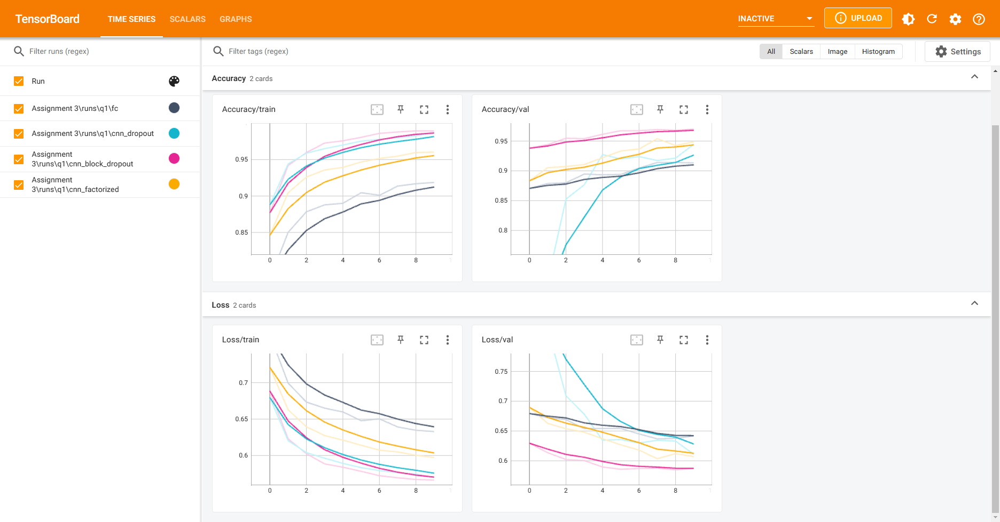

# Assignment 3
# Name: Saeedreza Zouashkiani
# Student ID: 400206262

## Question 1
This question focuses on the performance comparison between MLP and CNN with the same number of parameters. 
It was seen that using simple dropout after convolutional layers does't improve the performance of the model. The problem with simple dropout after convolutional layers is that it randomly drops out some of the neurons in the convolutional layers which means that the model is not able to learn the features of the images. Since convolutional layers have few parameters, they need less regularization to begin with. Furthermore, because of the spatial relationships encoded in feature maps, activations can become highly correlated. This renders dropout ineffective. For this reason, we use BlockDropout which is a more effective way of regularizing convolutional layers.
We also used factorized kernels in the convolutional layers.
Generally speaking, factorized kernels reduce the number of parameters in the model, which makes the training faster and the model to take less memory. In this problem however, because we wanted to compare the performance of MLP with CNN, we used the same number of parameters. Therefore, the reduced number of parameters in the CNN model didn't show up.

### Tensorboard results:

## Question 2

This question focuses on knowledge distillation on CIFAR-10 dataset. At first a pretrained ResNet50 was linear-tuned on CIFAR-10 dataset. Then, the linear-tuned model was used as a teacher model to train a student model. The student model was a pretrained ResNet18. The student model was trained using the knowledge distillation loss function from the paper "Distilling the Knowledge in a Neural Network" by Geoffrey Hinton et al. The knowledge distillation loss function is defined as follows:

$ \mathcal{L}(x; W) = (1 -\alpha) * \mathcal{H}(y, \sigma(z_s, T=1)) + 
\alpha * \tau^2 \mathcal{H}(\sigma(z_t. T=\tau), \sigma(z_s, T=\tau)) $

Where $ \mathcal{H} $ is the cross-entropy loss function, $ \sigma $ is the softmax function, $ \alpha $ is the weight of the knowledge distillation loss function, $ z_s $ is the output of the student model, $ z_t $ is the output of the teacher model, and $ T $ is the temperature parameter. The temperature parameter is used to control the sharpness of the probability distribution. The higher the temperature, the more the probability distribution is smoothed out. 
Using hyperparameter search we found that the best hyperparameters are as follows:
* $\alpha = 0.9$
* $T = 10$

